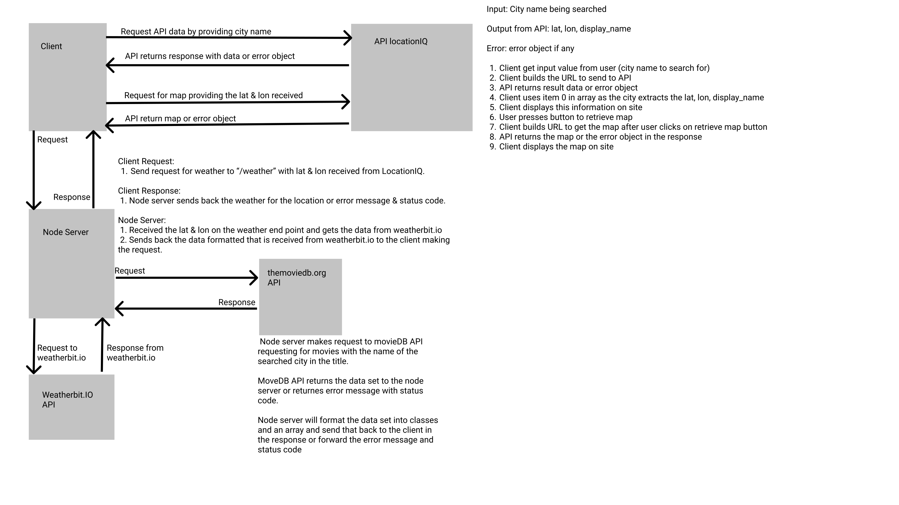

# city-explorer-api

**Author**: Willem Jacobs
**Version**: 1.0.2 (increment the patch/fix version number if you make more commits past your first submission)
**Deployed Site**: None - This backend server

## Overview

Backend server for the city explorer site. Will provide weather data from a data file for now. Will eventually interact with APIs for us.

## Getting Started

- Clone from repo. [Link to Repo](https://github.com/Willem-Jacobs/city-explorer-api)
- `npm install` or `npm i` to install dependencies.
- `.env` file needed with the API keys or other items needed for the site. Ensure .env is added to the `.gitignore` file.
  - `PORT=3001`

## Architecture

- Trello for Project Management
- Node.JS
- express
- dotenv
- cors
- nodemon to run server and restart at change to files.
- UML lab-06 - 
- UML lab-07 - 
- UML Lab-08 - 

## Change Log

07.27.2021 10:30am (V1.0.0) - Basic structure setup and deployed along with first route to weather. Used dummy data on a JSON file for now.

08.03.2021 10:50pm (v1.0.1) - Added call from server to weatherbit.io to get the 5 day forecast for the city eneted and return the data to front-end formatted as needed.

08.04.2021 9:19pm (v1.0.2) - Added the MovieDB API call to get movies using the city search string. Checks for the city name in the title. Creates a new data structure using a class and returns the data to the client.

## Credit and Collaborations

No collaborations from others on this project.

### Feature Lab-07 Trello Card #1

**Name of feature:** Basic structure setup and deployed

**Estimate of time needed to complete:** 1 hour

**Start time:** 09:30am

**Finish time:** 10:50am

**Actual time needed to complete:** 1:20 hour

### Feature 2 Lab-07 Trello Card #2

**Name of feature:** Route to /weather to get the data needed

**Estimate of time needed to complete:** 2 hours

**Start time:** 03:30pm

**Finish time:** 05:30pm

**Actual time needed to complete:** Hard to say as I worked on the front end and back end at the same time.

### Feature Lab 08 Trelly card 01

**Name of feature:** Fetch weather from weatherbit.i0

**Estimate of time needed to complete:** 1 hour

**Start time:** 9:30pm

**Finish time:** 10:30pm

**Actual time needed to complete:** 1 hour.

### Feature Lab-08 various cards

**Name of feature:** Weather from API and MovieDB API

**Estimate of time needed to complete:** 2 hours

**Start time:** 2 days various times

**Finish time:** unknown

**Actual time needed to complete:** about 2 hours to complete as I did plenty testing to ensure data correct and to learn. Probably could reduce to 1 hour if I worked only on these fatures.
