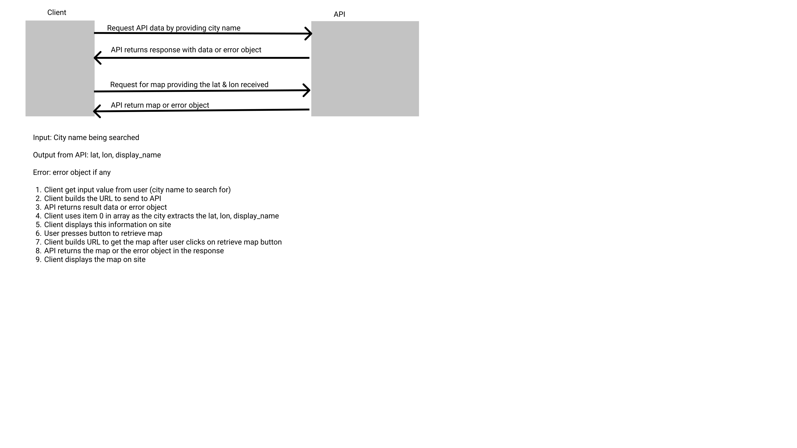

# city-explorer-api

**Author**: Willem Jacobs
**Version**: 1.0.0 (increment the patch/fix version number if you make more commits past your first submission)
**Deployed Site**: None - This backend server

## Overview

Backend server for the city explorer site. Will provide weather data from a data file for now. Will eventually interact with APIs for us.

## Getting Started

- Clone from repo. [Link to Repo](https://github.com/Willem-Jacobs/city-explorer-api)
- `npm install` or `npm i` to install dependencies.
- `.env` file needed with the API keys or other items needed for the site. Ensure .env is added to the `.gitignore` file.
  - `PORT=3001`

## Architecture

- Trello for Project Management
- Node.JS
- express
- dotenv
- cors
- UML picture - 

## Change Log

07.27.2021 10:30am (V1.0.0) - Basic structure setup and deployed.

## Credit and Collaborations

No collaborations from others on this project.

### Feature 1 Trello Card #1

**Name of feature:** Basic structure setup and deployed

**Estimate of time needed to complete:** 1 hour

**Start time:** 09:30am

**Finish time:** 10:50am

**Actual time needed to complete:** 1:20 hour

### Feature 2 Trello Card #2

**Name of feature:**

**Estimate of time needed to complete:**

**Start time:**

**Finish time:**

**Actual time needed to complete:**

### Feature 3 Trello card #3

**Name of feature:**

**Estimate of time needed to complete:**

**Start time:**

**Finish time:**

**Actual time needed to complete:**

### Feature 4 Trello card #4

**Name of feature:**

**Estimate of time needed to complete:**

**Start time:**

**Finish time:**

**Actual time needed to complete:**
